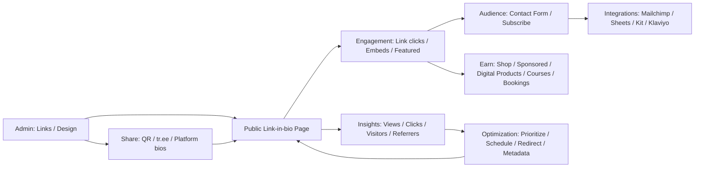

# Linktree 현재 기능 총정리 리서치 노트

파일명 제안: `linktree-feature-catalog_2026-03-11_ko.md`

## Executive Summary

본 문서는 Linktree의 **공식 웹사이트( linktr.ee )에 게시된 가격/기능 페이지 및 Help Center 문서**를 근거로, 2026-03-11(Asia/Seoul) 기준 **공개적으로 확인 가능한 기능을 카테고리별로 총정리**한 Markdown 리포트입니다. citeturn0search2turn12search0turn2search7  
요약하면 Linktree는 (1) 링크 인 바이오 페이지 제작/커스터마이징, (2) 링크/임베드(Link Apps) 기반의 콘텐츠·전환 최적화, (3) Insights 중심의 분석, (4) Audience(구독/폼)로 리드 수집 및 (5) Earn(Shop/스폰서드/디지털 상품·코스·예약 등)의 수익화, (6) Social Planner 기반의 소셜 पोस्ट 스케줄링+AI 보조, (7) tr.ee 단축링크/QR 기반의 배포·공유를 묶어 “크리에이터/브랜드 운영 도구” 형태로 확장되어 있습니다. citeturn0search2turn12search0turn14search0turn7search6  
또한 중요한 제약으로, Help Center 문서에 따르면 **linktr.ee/username 형태의 URL을 ‘커스텀 도메인’으로 대체하는 기능은 제공되지 않습니다.** citeturn18search2  

## Opentree 저장소 맥락

사용자 지정 커넥터(entity["company","GitHub","code hosting platform"])를 통해 확인한 `kidow/opentree`의 README에 따르면, **opentree는 “CLI-first link-in-bio generator”**로서 단일 `opentree.config.json`에서 정적 프로필 페이지를 생성하고, 터미널에서 설정/링크를 편집하며 로컬 프리뷰 후 entity["company","Vercel","deployment platform"] 연동으로 배포하는 흐름을 제공합니다(테마 템플릿, QR 출력, 로컬 클릭 트래킹, OG 이미지/파비콘 생성 등 포함). 즉, Linktree의 “호스팅형 SaaS”와 달리 **정적 사이트 생성+배포 자동화**로 Linktree의 핵심(링크 페이지) 영역을 대체하려는 접근이며, 이 문서의 Linktree 기능 카탈로그는 “어떤 SaaS 기능을 대체/미구현 상태로 둘지”를 판단하는 비교 기준으로 활용될 수 있습니다.

## 조사 범위와 출처

본 정리는 아래 범위만 사용했습니다.

- Linktree **Pricing/Features/Products/Solutions 페이지**(예: Pricing, Social Planner, Link Shortener, Rewards 등) citeturn0search2turn7search6turn14search2turn16search5  
- Linktree **Help Center( /help/en/** )의 How-to 및 정책/지원 문서 citeturn2search7turn12search0turn17search10  
- Linktree **Marketplace 앱 소개 페이지( /marketplace/apps/** )—특정 기능이 Help 문서 대신 Marketplace 개요로만 확인되는 경우에 한해 보조 근거로 사용 citeturn9search2turn30search13turn19search13  

문서에 **요금제/제한/위치가 명시되지 않은 항목은 “문서 미상”**으로 표기했습니다(요구사항 준수).

## Linktree 요금제와 제품 표면

Linktree의 공개 가격 페이지는 **Free / Starter / Pro / Premium**을 기본 요금제로 제시하며, 상위로 “Agency or Enterprise(문의)” 구간을 별도 표기합니다. citeturn0search2turn3view0  
또한 가격 페이지의 상단 구조 및 관련 제품/솔루션 페이지를 종합하면, 기능이 노출되는 “제품 표면(surface)”은 대략 다음처럼 나뉩니다.

- **My Linktree(Links 중심 Admin)**: 링크 추가/정렬/숨김, 각 링크별 설정(레이아웃/스케줄/락 등), 공유(QR/Share), 일부 설정(Subscribe 등) citeturn8search4turn10search0turn23search10  
- **Design**: 테마/배경/헤더(프로필 이미지/타이틀/바이오) 등 외형 커스터마이징 및 “Enhance” 자동 개선 citeturn13search2turn25search6turn24search7  
- **Insights**: 조회/클릭/클릭률/구독자/소스 등 성과 분석(플랜별 데이터 보존 기간, CSV 내보내기 등) citeturn12search0turn12search6  
- **Audience**: 폼·구독 등으로 수집된 리드/응답 관리 및 (Pro/Premium에서) 외부 도구 연동 citeturn6search1turn11search7  
- **Earn / Shop / Rewards**: Shops/스폰서드 링크/리워드, 디지털 상품·코스·예약 등 수익화 및 정산(지역/자격 제한 존재) citeturn15search4turn15search1turn16search0turn10search5  
- **Social Planner / Tools**: 소셜 스케줄링, Instagram 자동 DM, AI 캡션/아이디어/해시태그 등 citeturn7search1turn22search2turn22search5  
- **tr.ee 링크 도구**: 단축링크 생성/공유 방식, (Pro/Premium에서) 커스텀 및 “Direct to URL” 등 citeturn14search0  

## 기능 카탈로그

아래 표는 “기능명(한글/영문) → 설명 → 요금제 → UI/설정 위치(가능하면 링크) → 제한/비고” 형식으로 정리했습니다. URL은 요구사항에 따라 각 항목 옆에 표기했습니다(일부는 Help Center, 일부는 Product/Marketplace).

### 링크 관리

| 카테고리 | 기능명 (KR / EN) | 기능 설명 | 요금제 | UI/설정 위치 | 제한사항/비고 |
|---|---|---|---|---|---|
| 링크 관리 | 링크 생성 / Create a link | URL 또는 Link Apps를 추가해 버튼/임베드 형태로 게시 | 문서상 전 플랜(기본 기능) | Admin → Links → `+ Add` (https://linktr.ee/help/en/articles/5434135-how-to-create-a-link-on-linktree) citeturn8search4 | 유효 URL/제목 필요, 문제 시 “Unsafe URL” 등 경고 가능 citeturn17search0 |
| 링크 관리 | 링크 정렬 / Reorder links | 링크를 드래그해 상단 우선 노출 | 문서상 전 플랜 | Admin → Links 목록에서 드래그 (https://linktr.ee/help/en/articles/5434144-how-to-move-and-reorder-your-links) citeturn2search13 | 헤더/컬렉션 등으로 구조화 권장(문서 내 팁) citeturn2search13turn9search1 |
| 링크 관리 | 링크 숨김/비활성 / Hide or make inactive | 토글로 링크를 숨겨 방문자에게 비노출 | 문서상 전 플랜 | Admin → Links → 링크 토글 OFF (https://linktr.ee/help/en/articles/5434145-how-to-hide-or-make-a-link-inactive) citeturn2search9 | 필요 시 아카이브/삭제로 Admin 정리 가능(문서 팁) citeturn2search9 |
| 링크 관리 | 링크 스케줄링 / Schedule Links | 특정 시점에 링크를 자동 공개/숨김(프로모션/런칭용) | Starter/Pro/Premium | Admin → Links → 링크의 캘린더 아이콘(스케줄) (https://linktr.ee/help/en/articles/5434174-schedule-links-on-your-linktree) citeturn10search0 | 시간대(Time zone) 선택 필요 citeturn10search0 |
| 링크 관리 | 리다이렉트 링크 / Redirect | 일정 기간 동안 바이오 링크 방문자를 특정 링크로 “우회” 전송 | Starter/Pro/Premium | Admin → Links → 링크 아래 화살표 아이콘 → Redirect (https://linktr.ee/help/en/articles/5434176-how-to-set-up-a-redirect) citeturn7search0 | 만료 시 자동 복구, 분석/픽셀 통합에 포함(문서 명시) citeturn7search0 |
| 링크 관리 | Featured 레이아웃 / Featured Layouts | 링크를 시각적 미리보기(썸네일/플레이어 등)로 확장해 클릭 유도 | 문서 미상(플랜 표기 없음) | Admin → Links → 각 링크의 Layout 탭/아이콘 (https://linktr.ee/help/en/articles/8580581-highlight-your-links-with-featured-layouts) citeturn2search0 | 클래식 링크는 16:9 썸네일 권장 citeturn2search0 |
| 링크 관리 | Prioritize(애니메이션/스포트라이트) / Prioritize Links | “가장 중요한 링크”를 애니메이션/Spotlight 자동 확장으로 강조 | Starter/Pro/Premium | Admin → Links → 링크의 별(⭐) 아이콘 (https://linktr.ee/help/en/articles/5434173-how-to-prioritize-a-link) citeturn2search8 | **한 번에 1개 링크만** 우선순위 지정 가능 citeturn2search8 |
| 링크 관리 | 링크 썸네일/아이콘 / Link Thumbnails | 링크별 썸네일 이미지/아이콘을 붙여 가독성/시각성 강화 | 문서 미상(플랜 제한은 개별 기능에서 별도 표기) | Admin → Links → Thumbnail 아이콘 → Set Thumbnail (https://linktr.ee/help/en/articles/5434160-how-to-add-a-thumbnail-icon-to-your-links) citeturn6search5 | Tabler Icons 선택 또는 이미지 업로드, **AI 썸네일(BETA)** 옵션 존재 citeturn6search5turn22search4 |
| 링크 관리 | 컬렉션 / Collections | 링크를 폴더/그룹으로 묶고 레이아웃(Stack/Grid/Carousel/Showcase) 제공 | Grid/Carousel/Showcase는 Starter/Pro/Premium, Stack은 기본 | Admin → Links → Add Collection (https://linktr.ee/help/en/articles/5434163-organize-your-links-with-collections) citeturn7search5 | Showcase는 베타로 일부 사용자 미노출 가능 citeturn9search1 |
| 링크 관리 | 공유 가능한 컬렉션 / Shareable Collections | 컬렉션 자체를 단일 페이지로 공유(컬렉션 전용 tr.ee URL) | 문서 미상 | Collection → Share 아이콘 → tr.ee URL 복사 (https://linktr.ee/help/en/articles/5434163-organize-your-links-with-collections) citeturn9search1 | 캠페인/번들 공유에 적합(문서 팁) citeturn9search1 |
| 링크 관리 | 헤더(섹션 구분) / Headers | 링크/앱을 제목 헤더로 구분해 탐색성 향상 | 문서 미상 | Marketplace → Header 앱 추가(https://linktr.ee/marketplace/apps/header) citeturn9search2 | Help Center 문서가 아닌 Marketplace 개요로 기능 확인 |
| 링크 관리 | 텍스트 블록 / Text link | 링크 대신 텍스트(최대 1,000자) + 선택적 CTA 버튼 제공 | 문서 미상 | Admin → Links → Add → “Text” (https://linktr.ee/help/en/articles/8942377-how-do-i-add-text-content-to-my-linktree) citeturn21search3 | 장문은 PDF/문서 링크 권장 citeturn21search3 |
| 링크 관리 | PDF 표시 / PDF Display | PDF를 업로드해 Linktree 내에서 미리보기/다운로드 제공 | 문서 미상 | Admin → Links → Add → “PDF Display” (https://linktr.ee/help/en/articles/6395488-how-to-display-a-pdf-on-your-linktree) citeturn28search0 | **PDF 50MB까지** 지원 citeturn28search0 |
| 링크 관리 | RSS 피드 링크 / RSS Feed Link | RSS 2.0 피드를 불러와 글 목록을 Linktree에 표시 | Starter/Pro/Premium | Admin → Links → RSS URL 추가 → RSS 아이콘 설정 (https://linktr.ee/help/en/articles/5434185-how-to-add-an-rss-feed-link-to-your-linktree) citeturn8search11 | **RSS 2.0만** 지원(명시) citeturn8search11 |

### 디자인 및 테마

| 카테고리 | 기능명 (KR / EN) | 기능 설명 | 요금제 | UI/설정 위치 | 제한사항/비고 |
|---|---|---|---|---|---|
| 디자인/테마 | 테마 선택 / Themes | 큐레이션 테마를 선택해 외형을 빠르게 변경 | 일부 테마는 Starter/Pro/Premium | Admin → Design → Themes (https://linktr.ee/help/en/articles/5434137-choose-a-theme-for-your-linktree) citeturn13search2 | 번개 아이콘 테마는 유료 플랜 전용(명시) citeturn13search2 |
| 디자인/테마 | 커스텀 테마 / Customizable theme | 색/텍스트/버튼/헤더/배경을 세부 조정 | 문서 미상(단, 배경 업로드는 유료 조건 명시) | Admin → Design → Theme → Customizable theme (https://linktr.ee/help/en/articles/5434137-choose-a-theme-for-your-linktree) citeturn13search2 | 배경 이미지/비디오 업로드는 Starter/Pro/Premium citeturn13search2 |
| 디자인/테마 | 디자인 가이드 / Customizing design | 프로필 사진/타이틀/설명, 배경·버튼·폰트 등 일관된 브랜딩 가이드 제공 | 문서 미상 | Help Center 가이드(https://linktr.ee/help/en/articles/8614125-customizing-your-linktree-design) citeturn13search1 | Free는 색상 배경 중심, Pro+는 이미지/비디오 업로드 가능(가이드 내 명시) citeturn13search1 |
| 디자인/테마 | 프로필 이미지(사진/GIF/비디오/AI/Canva) / Profile image | 원형(Classic) 또는 Hero 레이아웃, 영상 프로필/AI 생성/entity["company","Canva","design platform"] 편집 연동 | 비디오/AI/Hero는 Starter/Pro/Premium | Admin → Design → Header → Profile image (https://linktr.ee/help/en/articles/9036585-add-or-change-your-linktree-profile-image) citeturn13search3 | 비디오 50MB 제한 등 조건 명시 citeturn13search3 |
| 디자인/테마 | 타이틀(표시명) 변경 / Profile title | 상단 표시명(브랜드/이름)을 수정 | 문서 미상 | Admin → Design → Header 또는 Links 상단 Profile 영역(https://linktr.ee/help/en/articles/5434181-change-your-linktree-title) citeturn8search10 | 사용자명(URL)과는 별개 citeturn8search10turn18search0 |
| 디자인/테마 | 바이오(160자) / Bio description | 상단에 짧은 소개 문구(최대 160자) 표시 | 문서 미상 | Admin → Links → Profile 영역 → Add bio (https://linktr.ee/help/en/articles/5434148-how-to-add-a-bio-description) citeturn24search7 | 장문은 Text link 권장(문서 팁) citeturn24search7turn21search3 |
| 디자인/테마 | 커스텀 배경(이미지/비디오/Canva/스톡/NFT) / Custom background | 배경 이미지/비디오 업로드, entity["company","Unsplash","photo platform"] 이미지/entity["company","Coverr","stock video platform"] 비디오 선택, Canva 디자인 가능 | Starter/Pro/Premium | Admin → Design → Wallpaper (https://linktr.ee/help/en/articles/5434177-how-to-add-a-custom-image-or-video-background-to-your-linktree) citeturn13search0 | 이미지 10MB(권장 규격 포함), 비디오 50MB·지원 포맷 명시 citeturn13search0 |
| 디자인/테마 | Enhance(자동 디자인 개선) / Enhance feature | AI 기반으로 배경/버튼/폰트 등 디자인을 “원클릭” 개선 후 적용 선택 | 문서 미상 | Admin → Design → Enhance (https://linktr.ee/help/en/articles/12164667-use-the-enhance-feature-to-instantly-glow-up-your-linktree) citeturn25search6 | 설정 체크리스트 완료 후 사용(명시) citeturn25search6 |
| 디자인/테마 | Linktree 로고 숨김 / Hide Linktree logo | 프로필 하단 푸터(및 QR 내 로고)에서 Linktree 브랜딩 제거 | Pro/Premium | Admin → Links 하단(푸터 토글) 또는 Share → QR Customize (https://linktr.ee/help/en/articles/5434182-can-i-hide-the-linktree-logo) citeturn13search4 | QR에서 “자체 로고 업로드”도 함께 언급됨 citeturn13search4turn2search2 |

### 분석 및 통계

| 카테고리 | 기능명 (KR / EN) | 기능 설명 | 요금제 | UI/설정 위치 | 제한사항/비고 |
|---|---|---|---|---|---|
| 분석/통계 | Insights 개요 / Insights | Views/Clicks/Click Rate/Subscribers 등 핵심 지표와 섹션별 분석 제공 | 전 플랜(기간/심화는 플랜별 차등) | Admin → Insights (https://linktr.ee/help/en/articles/5434178-understanding-your-insights) citeturn12search0 | 데이터 보존 기간이 플랜별 상이(Free 28d, Starter 90d, Pro 365d, Premium lifetime) citeturn12search0 |
| 분석/통계 | 방문자 분석 / Visitors | 관심사(조건부), 유입경로, 위치, 디바이스 등 방문자 인사이트 | Pro/Premium | Insights → Visitors 섹션 (https://linktr.ee/help/en/articles/5434178-understanding-your-insights) citeturn12search0 | Interests는 최근 90일 100+ 유니크 방문자 조건 등 제한 명시 citeturn12search0 |
| 분석/통계 | 개별 링크 인사이트 / Individual Link Insights | 링크별 클릭 수, 상위 유입경로/지역/디바이스 등 확인 | 전 플랜(커스텀 기간은 유료) | Admin → Links → 링크 아래 차트 아이콘 (https://linktr.ee/help/en/articles/5434172-individual-link-insights) citeturn11search5 | 커스텀 기간(최대 365일)은 Starter+에서 제공(명시) citeturn11search5 |
| 분석/통계 | QR 스캔 수 추적 / QR scans in Insights | QR 코드 스캔 수를 Insights에서 확인 | Starter/Pro/Premium | Insights → Visitors 섹션(문서 안내) (https://linktr.ee/help/en/articles/5434152-create-a-qr-code-for-your-linktree) citeturn2search2 | QR 커스터마이즈는 Pro/Premium citeturn2search2 |
| 분석/통계 | CSV 내보내기 / Export Insights CSV | Insights 활동/도시/국가/디바이스/레퍼러 CSV 다운로드 | Premium | Insights → Download 버튼(메일로 ZIP 전송) (https://linktr.ee/help/en/articles/5707122-download-a-csv-of-your-insights-activity) citeturn12search6 | 이메일로 전송되는 형태(명시) citeturn12search6 |

### 통합 및 연동

| 카테고리 | 기능명 (KR / EN) | 기능 설명 | 요금제 | UI/설정 위치 | 제한사항/비고 |
|---|---|---|---|---|---|
| 통합/연동 | Link Apps(임베드 링크) / Link Apps | 플랫폼 콘텐츠를 Linktree 내에서 재생/응답/전환(“떠나지 않고” 동작) | 문서 미상(앱별 상이) | Admin → Links → View all apps / Marketplace (https://linktr.ee/help/en/articles/8614037-adding-links-what-s-possible) citeturn8search5 | “30+ Link Apps” 언급(문서) citeturn8search5 |
| 통합/연동 | Instagram 프로필/포스트 미리보기 / Instagram Link App | 인스타 프로필과 최신 게시물/릴스 일부를 Linktree에 표시 | 문서 미상 | Admin → Links → Instagram URL 추가 또는 Link Apps 검색 (https://linktr.ee/help/en/articles/8629127-how-can-i-display-my-instagram-profile-and-posts-on-my-linktree) citeturn23search9 | 연결/인증 흐름 포함(문서) citeturn23search9 |
| 통합/연동 | Instagram Grid(클릭 가능한 포스트) / Instagram Grid | 인스타 그리드를 Linktree에 복제하고 **포스트당 최대 5개 링크**를 부여 | 문서 미상 | Help Center 가이드(https://linktr.ee/help/en/articles/10143051-replicate-your-instagram-grid-on-linktree-with-clickable-posts) citeturn23search0 | 방문자에겐 “링크가 붙은 포스트만” 보임(FAQ) citeturn23search0 |
| 통합/연동 | RSS 피드(콘텐츠 임베드) / RSS Feed Link | 블로그/뉴스 최신 글을 자동 표시 | Starter/Pro/Premium | Admin → Links → RSS URL 설정 (https://linktr.ee/help/en/articles/5434185-how-to-add-an-rss-feed-link-to-your-linktree) citeturn8search11 | RSS 2.0 제한 citeturn8search11 |
| 통합/연동 | 예약(캘린더) / Calendly embed | entity["company","Calendly","scheduling platform"] 링크를 임베드 또는 외부 이동으로 제공 | 문서 미상 | Admin → Links → URL 추가 → 설정에서 Embed 선택(https://linktr.ee/help/en/articles/8197084-add-a-calendly-link-to-your-linktree) citeturn10search10 | Calendly 커스텀 디자인 반영 불가(명시) citeturn10search10 |
| 통합/연동 | 설문/폼(외부) / Typeform link | entity["company","Typeform","online form platform"] 설문을 Linktree에 표시 또는 외부 이동 | 문서 미상 | Admin → Links → View all apps → Typeform (https://linktr.ee/help/en/articles/6230733-how-to-add-a-typeform-link) citeturn21search9 | Typeform Admin 내 “Add to Linktree” 버튼 노출(가이드) citeturn21search9 |
| 통합/연동 | 이벤트/투어 / Tours and Events | Seated/Bandsintown 기반 투어/공연 일정 표시 | 문서 미상 | Admin → Links → Tours and Events 설정 (https://linktr.ee/help/en/articles/5915532-how-to-add-a-tours-and-events-link) citeturn21search5 | Bandsintown/Seated 표시 옵션 차등 citeturn21search5 |
| 통합/연동 | Web3/NFT(OpenSea/NFT Gallery) / Web3 & NFT link types | entity["company","OpenSea","nft marketplace"] 기반 NFT 미리보기/갤러리, 소유자 전용 락 등 | 문서 미상(기능별 조건 표기) | 관련 가이드 모음(https://linktr.ee/help/en/articles/6215009-web3-and-nft-link-types-on-linktree) citeturn29search7 | Ethereum 민팅/일부 지갑(예: entity["company","MetaMask","crypto wallet"]) 등 제약 명시 citeturn29search9turn29search8 |

### 리드 수집 및 CRM 성격 기능

| 카테고리 | 기능명 (KR / EN) | 기능 설명 | 요금제 | UI/설정 위치 | 제한사항/비고 |
|---|---|---|---|---|---|
| 리드/CRM | Contact Form / Contact Form | 방문자 문의/리드 수집(필드 커스터마이즈, 템플릿, 알림) | 전 플랜(단, Custom T&Cs는 제한) | Admin → Links → Add → “Contact form” (https://linktr.ee/help/en/articles/5651972-how-to-add-a-contact-form-to-your-linktree) citeturn6search1 | Custom T&Cs는 Pro/Premium citeturn6search1 |
| 리드/CRM | Contact Details(vCard) / Contact Details link | 방문자에게 내 연락처를 vCard(VCF)로 제공(다운로드) | 문서 미상 | Admin → Links → View all apps → Contact Details (https://linktr.ee/help/en/articles/5912619-how-to-add-a-contact-details-link) citeturn6search2 | 다운로드 파일은 VCF(vCard) citeturn6search2 |
| 리드/CRM | Subscribe(구독) / Subscribe | 링크 추가/업데이트 시 구독자에게 이메일 알림(즉시/예약 발송) | 문서 미상 | Admin → Links → Settings → Subscribe (https://linktr.ee/help/en/articles/5735268-subscribe-to-a-linktree) citeturn8search7 | `?subscribe`로 구독 폼 직링크 가능 citeturn10search2 |
| 리드/CRM | Audience 통합 연동 / Third-party audience integrations | 폼/디지털상품/코스 가입 데이터 등을 외부 툴로 자동 동기화 | Pro/Premium | Admin → Audience → Integrations (https://linktr.ee/help/en/articles/11069074-setting-up-third-party-audience-integrations) citeturn11search7 | 지원 도구: entity["company","Mailchimp","email marketing platform"], entity["company","Klaviyo","email marketing platform"], Kit, Google Sheets(문서) citeturn11search7turn6search9 |
| 리드/CRM | 이메일/전화 직접 링크 / Email or phone number link | email:, tel:, sms: 등의 링크를 만들어 바로 연락 유도 | 문서 미상 | Admin → Links → + Add link → URL에 이메일/전화 포맷 입력 (https://linktr.ee/help/en/articles/6790531-adding-your-email-or-phone-number-to-your-linktree) citeturn6search4 | 이메일/전화는 Social icon으로도 추가 가능(문서) citeturn6search4turn26search10 |

### 수익화 및 상업 기능

| 카테고리 | 기능명 (KR / EN) | 기능 설명 | 요금제 | UI/설정 위치 | 제한사항/비고 |
|---|---|---|---|---|---|
| 수익화 | Shop(제휴/커머스 탭) / Shop | Linktree 내 “Shop” 탭에 제휴/상품을 모아 전시, 컬렉션 구성 | 🇺🇸 Shops는 US-only(자격/지역) | Admin → Shop 탭 (https://linktr.ee/help/en/articles/8910562-using-shop-to-promote-affiliate-recommendations) citeturn15search1 | 방문자 URL에 `/shop`로 Shop 직행 가능 citeturn15search1turn23search5 |
| 수익화 | Shop 게시물(Post) / Shop posts | 인스타/틱톡 콘텐츠를 “포스트”로 만들고 여러 상품을 연결 | 문서 미상 | Shop → +Add → Post (https://linktr.ee/help/en/articles/9328194-linktree-shops-how-to-guide) citeturn23search5 | “Posts는 모바일 앱에서만 가능” FAQ 표기 citeturn23search4 |
| 수익화 | Sponsored Links(스폰서드) / Sponsored links | 브랜드 오퍼를 프로필에 붙여 전환(CPA 등) 발생 시 수익 | 🇺🇸 US-only(자격/콘텐츠 조건) | Admin → Earn 탭 → Sponsored links (https://linktr.ee/help/en/articles/11006101-how-to-earn-with-sponsored-links-on-your-linktree) citeturn15search2 | **동시 3개까지** 활성 가능(명시) citeturn15search2 |
| 수익화 | Rewards(리워드) / Linktree Rewards | 행동/성과 기반 포인트·티어·보너스 지급 프로그램 | 🇺🇸 US-only(자격) | Admin → Earn → Rewards (https://linktr.ee/help/en/articles/11006092-how-to-earn-perks-with-linktree-rewards) citeturn16search0 | 30일 윈도우/티어 재평가 규칙 등 존재 citeturn16search0turn16search2 |
| 수익화 | Digital Products(디지털 상품) / Digital Products | 파일 업로드(최대 24개), 무료/유료로 배포, 구매자 관리 | 문서 미상(단, 정산/자격/수수료는 별도 문서) | Admin → Links → Add → “Digital Products” (https://linktr.ee/help/en/articles/10631437-how-to-share-and-sell-digital-products-on-your-linktree) citeturn15search5 | 파일 1개당 100MB, 형식 제한 등 명시 citeturn15search5 |
| 수익화 | 디지털 상품 수수료 / Seller fees | 플랜별 Linktree 수수료: Free 12%, Starter/Pro 9%, Premium 0% (추가로 결제 처리 수수료 별도) | 플랜별 상이 | Help Center 수수료 안내(https://linktr.ee/help/en/articles/10518645-guide-to-selling-digital-products-on-linktree) citeturn15search3 | 결제는 entity["company","Stripe","payments platform"] 기반, 국가별 처리 수수료 존재(명시) citeturn0search1turn15search4 |
| 수익화 | Courses(온라인 코스) / Courses | entity["company","Kajabi","online course platform"] 연동 기반으로 코스를 만들어 판매/배포 | 문서 미상 | Admin → Links → Add → “Course” (https://linktr.ee/help/en/articles/10489182-create-an-online-course-with-linktree) citeturn14search7 | 결제/자격/수수료는 Earn 정책/수수료 문서 참조 citeturn0search1turn15search4 |
| 수익화 | Bookings(예약/유료 세션) / Bookings | Linktree 내에서 무료/유료 예약 슬롯 제공(캘린더 연동) | 문서 미상 | Admin → Links → Add → “Bookings” (https://linktr.ee/help/en/articles/11567751-how-to-offer-bookings-on-your-linktree) citeturn10search5 | Google Calendar 연동 및 충돌 체크 언급 citeturn10search5 |
| 수익화 | Discount Code(쿠폰 코드) / Discount Code link | 방문자가 코드를 복사한 뒤 상점으로 이동하도록 유도 | 문서 미상 | Admin → Links → View all apps → Discount Code (https://linktr.ee/help/en/articles/9334619-how-to-display-a-discount-code-on-your-linktree) citeturn30search0 | Marketplace 개요도 존재(https://linktr.ee/marketplace/apps/discount-code) citeturn30search13 |
| 수익화 | SendOwl 연동 / SendOwl Link App | SendOwl 상품/스토어를 Linktree에 표시해 판매 유도 | 문서 미상 | Admin → Links → Add → “SendOwl” (https://linktr.ee/help/en/articles/6838231-how-do-i-display-my-sendowl-products-on-my-linktree) citeturn15search7 | Linktree 내장 Digital Products와 별개로 “외부 상점 임베드” 성격 citeturn15search6turn15search7 |
| 수익화 | Earn 기능 이용 가능 국가/자격 / Who can use Earn | Shops/Sponsored/Rewards=미국, Digital Products/Courses/Bookings=지원 국가 목록 기반 | 기능별 상이 | Help Center 정책(https://linktr.ee/help/en/articles/11126119-who-can-use-linktree-s-earn-features) citeturn15search4 | Earn은 “선택된 국가에서만” 제공(명시) citeturn15search4turn12search0 |

### SEO 및 메타데이터

| 카테고리 | 기능명 (KR / EN) | 기능 설명 | 요금제 | UI/설정 위치 | 제한사항/비고 |
|---|---|---|---|---|---|
| SEO/메타 | 메타데이터(타이틀/설명) / Metadata | 공유 미리보기·검색 결과에 쓰이는 meta title/description을 커스텀 | Pro/Premium | Admin → Settings → SEO → Meta title/description (https://linktr.ee/help/en/articles/5434180-how-can-i-change-my-metadata) citeturn24search4 | 변경 전파에 시간 소요 가능(명시) citeturn24search4 |
| SEO/메타 | UTM 파라미터 자동 설정 / UTM Parameters | 모든 링크에 UTM을 붙여 분석 도구가 유입을 더 잘 구분하도록 지원 | Pro 이상 | Admin → Links → Settings → Analytics Integrations → UTM toggle (https://linktr.ee/help/en/articles/5434179-how-to-add-utm-parameters) citeturn11search6 | 기본값은 GA에서 Social로 보이도록 설계(문서) citeturn11search6 |

### 보안, 접근 제어, 정책 준수

| 카테고리 | 기능명 (KR / EN) | 기능 설명 | 요금제 | UI/설정 위치 | 제한사항/비고 |
|---|---|---|---|---|---|
| 보안/접근 | MFA(다중 인증) / Multi-factor Authentication | 로그인 시 추가 인증(SMS 또는 Authenticator)으로 계정 보호 | 문서 미상 | Admin → My Account → Security and privacy → MFA (https://linktr.ee/help/en/articles/6108442-protect-your-linktree-account-with-mfa-multi-factor-authentication) citeturn17search10 | SMS는 일부 국가(US/AU/UK/CA)로 제한(명시) citeturn17search10 |
| 보안/접근 | 링크 코드 락 / Code Lock | 특정 링크 접근 전 4자리 코드 입력 요구 | Pro 이상 | Admin → Links → 링크 설정의 lock 아이콘 → Code (https://linktr.ee/help/en/articles/5576271-code-lock-on-links) citeturn29search1 | **4자리 숫자만** 허용 citeturn29search1 |
| 보안/접근 | 나이(생년월일) 락 / Age Lock | 생년월일 입력 및 최소 연령 조건으로 링크 접근 제한 | 문서 미상 | Admin → Links → lock 아이콘 → Date of Birth (https://linktr.ee/help/en/articles/5443080-age-lock-on-links) citeturn29search2 | 동일 연령 기준이면 세션 내 1회 입력으로 복수 링크 해제 등 동작 명시 citeturn29search2 |
| 보안/접근 | Subscribe 락 / Subscribe Lock | 구독자만 볼 수 있는 “구독자 전용 링크” 제공 | 문서 미상 | Admin → Links → lock 아이콘 → Subscribe (https://linktr.ee/help/en/articles/5983826-subscribe-lock-on-links) citeturn29search3 | 비구독자는 이메일+검증코드로 구독 후 접근(명시) citeturn29search3turn10search2 |
| 보안/접근 | Sensitive Content Labels / Sensitive material warning | 프로필 오버레이 또는 링크 단위 경고/락(Over 18/21/25 등) | 문서 미상 | Admin → Links → Settings → Sensitive material 또는 링크 lock → Sensitive Content (https://linktr.ee/help/en/articles/5434166-sensitive-content-labels) citeturn17search5 | 활성화 시 Earn 기능 제한 가능(결제 프로세서 제한) citeturn17search5turn15search4 |
| 정책/신뢰 | Unsafe URL 차단/경고 / Unsafe URL | 커뮤니티 스탠더드 위반 가능 링크는 “Unsafe URL”로 표시/제한 | 문서 미상 | 링크 추가 시 경고/항소 가능(https://linktr.ee/help/en/articles/5434125-links-not-showing-on-your-linktree) citeturn17search0 | 항소 절차 언급 citeturn17search0turn17search3 |
| 정책/신뢰 | 위반 신고 / Reporting violations | 스팸/사기/부적절 프로필을 신고해 검토/비활성화 요청 | 문서 미상 | Report a Violation 폼 안내(https://linktr.ee/help/en/articles/5434084-reporting-violations) citeturn17search2 | 커뮤니티 안전 목적(문서) citeturn17search2 |
| 정책/신뢰 | Earn 금지 콘텐츠 / Non-monetizable content rules | 결제 프로세서 정책에 따라 Digital Products로 판매 불가 항목 정의 | 문서 미상 | 정책 문서(https://linktr.ee/help/en/articles/10660251-non-monetizable-content-guidelines-for-digital-products) citeturn15search0 | 성인물/불법/규제 품목 등 제한 명시 citeturn17search7turn15search0 |

### 배포, 공유, 도메인

| 카테고리 | 기능명 (KR / EN) | 기능 설명 | 요금제 | UI/설정 위치 | 제한사항/비고 |
|---|---|---|---|---|---|
| 공유/배포 | Linktree URL 공유 / Share Linktree | 인스타/기타 플랫폼 바이오에 Linktree URL 배치, 공유 팁 제공 | 문서 미상 | 가이드(https://linktr.ee/help/en/articles/5434136-sharing-your-linktree) citeturn23search10 | Share 메뉴에서 URL/QR 복사 안내 citeturn23search10turn2search2 |
| 공유/배포 | QR 코드 생성/다운로드 / Linktree QR | Linktree로 연결되는 QR(PNG/SVG) 저장 및 배포 | 전 플랜(생성/다운로드) | Admin → Links → Share → My Linktree QR code (https://linktr.ee/help/en/articles/5434152-create-a-qr-code-for-your-linktree) citeturn2search2 | QR 커스터마이즈(색/로고/로고 숨김)는 Pro/Premium citeturn2search2turn13search4 |
| 공유/배포 | tr.ee 단축링크 / Tr.ee short links | Linktree 내부에서 링크를 짧게 공유(하이라이트 or 직접 이동) 또는 단독 툴로 생성 | 문서 미상 | Admin → Links → 링크 Share 아이콘 → tr.ee 옵션 (https://linktr.ee/help/en/articles/8133719-how-to-shorten-and-share-links-with-tr-ee-links) citeturn14search0 | Pro/Premium에서 커스텀 tr.ee 및 “Direct to URL” 가능(명시) citeturn14search0 |
| 공유/배포 | 커스텀 도메인 / Custom domain | Linktree URL을 자체 도메인으로 대체 | **불가** | 정책 문서(https://linktr.ee/help/en/articles/6571689-can-i-change-the-linktree-url-to-a-custom-domain) citeturn18search2 | 도메인 포워딩 개발자 도구도 제공하지 않음(명시) citeturn18search2 |
| 공유/배포 | Redirect로 “자체 도메인 → Linktree” 우회 | 커스텀 도메인 자체는 불가하나, 특정 캠페인에서 Redirect로 특정 URL로 우회 가능 | Starter/Pro/Premium | Redirect 기능(https://linktr.ee/help/en/articles/5434176-how-to-set-up-a-redirect) citeturn7search0 | “바이오 링크 교체 없이” 캠페인 운영 목적(문서) citeturn7search0 |

### 모바일 앱 및 운영 확장

| 카테고리 | 기능명 (KR / EN) | 기능 설명 | 요금제 | UI/설정 위치 | 제한사항/비고 |
|---|---|---|---|---|---|
| 모바일/운영 | Linktree 앱 / Linktree App | iOS/Android용 앱 제공, 동일 계정으로 로그인 가능 | 문서 미상 | 앱 FAQ(https://linktr.ee/help/en/articles/6366453-the-linktree-app-for-ios-and-android) citeturn19search2 | iOS 13+/Android 5+, 태블릿 미지원(명시) citeturn19search2 |
| 모바일/운영 | iOS 브라우저 공유로 링크 추가 / iOS native sharing | iOS Share Sheet에서 “Add to my Linktree”로 빠른 링크 추가 | 문서 미상 | 가이드(https://linktr.ee/help/en/articles/6568819-add-links-to-your-linktree-straight-from-your-ios-browser) citeturn19search1 | iOS 전용, Android는 추후 희망(명시) citeturn19search1 |
| 운영 확장 | 다중 Linktree 프로필 / Multiple Linktrees | 한 로그인(이메일)로 여러 Linktree 프로필 생성/전환/관리 | 문서 미상 | Account menu → Create a new Linktree (https://linktr.ee/help/en/articles/5434124-how-to-create-and-manage-multiple-linktrees) citeturn6search0 | 프로필은 서로 독립 커스터마이즈 가능(FAQ) citeturn6search0 |
| 운영 확장 | 멀티 Admin 초대 / Invite admin user | 다른 사용자를 Admin으로 초대해 운영 위임(권한 부여) | Pro/Premium | Admin → Account menu → Invite admin (https://linktr.ee/help/en/articles/8609951-how-to-add-an-admin-user-to-manage-your-linktree) citeturn18search8 | 상호(Admin 상호 접근)은 별도 초대 필요(명시) citeturn18search8 |
| 운영 확장 | 언어 지원 / Language support | App/Admin은 영어만 제공(브라우저 번역 권장) | 문서 미상 | 안내(https://linktr.ee/help/en/articles/6484359-what-languages-does-linktree-support) citeturn20search10 | 번역 문제는 브라우저/지원팀 한계 명시 citeturn20search10 |

### 소셜 운영 및 마케팅 툴

| 카테고리 | 기능명 (KR / EN) | 기능 설명 | 요금제 | UI/설정 위치 | 제한사항/비고 |
|---|---|---|---|---|---|
| 소셜/마케팅 | Social Planner(스케줄러) / Social Planner | 콘텐츠 캘린더, 자동 게시, 크로스포스트(플랫폼 다수) | 문서 미상(페이지는 “free” 언급, 제한은 플랜별일 수 있음) | 제품 페이지(https://linktr.ee/features/social-planner) citeturn7search6 | 업그레이드 시 무제한/고급 기능 등 언급(FAQ) citeturn7search6 |
| 소셜/마케팅 | Instagram Auto-Reply(자동 DM) / Instagram auto-reply | 댓글 트리거로 DM에 링크 자동 발송(키워드/스마트매치 등) | Free~Premium(한도는 플랜별) | Admin → Instagram auto-reply 페이지 (https://linktr.ee/help/en/articles/9758234-use-instagram-auto-reply-to-automatically-share-links-with-your-audience) citeturn7search1 | DM 월 한도: Free 1000, Starter 1500, Pro 2500, Premium 무제한(문서) citeturn7search1 |
| 소셜/마케팅 | AI 포스트/캡션 아이디어 / Post Ideas | 트렌딩/에버그린/훅 등 아이디어 생성 후 캡션 생성, Social Planner로 연결 | 문서 미상 | Admin → Tools → Post Ideas (https://linktr.ee/help/en/articles/11644438-how-to-generate-ai-post-and-caption-ideas) citeturn22search2 | 커뮤니티 스탠더드 준수 요청만 생성(명시) citeturn22search2 |
| 소셜/마케팅 | Hashtag Generator / Hashtag generator | 플랫폼별 해시태그 추천 및 저장 리스트 기능(언급) | 문서 미상 | 제품 페이지(https://linktr.ee/products/social-scheduler/hashtag-generator) citeturn22search5 | 저장/리스트 기능 가능하다고 설명(FAQ) citeturn22search5 |
| 소셜/마케팅 | Meta Pixel 연동 / Meta Pixel | 픽셀/Conversions API 토큰 설정, PageView/linkClick 이벤트 트래킹 | Pro/Premium | Admin → Settings → Analytics integrations (https://linktr.ee/help/en/articles/5434194-facebook-meta-pixel-integration) citeturn11search1 | 도메인 허용 목록 등 트러블슈팅 가이드 포함 citeturn11search1 |
| 소셜/마케팅 | Google Analytics 연동 / Google Analytics | 측정 ID(Measurement ID)를 넣어 GA에서 이벤트 트래킹 | Pro/Premium | Admin → Settings → Analytics Integrations (https://linktr.ee/help/en/articles/5434201-google-analytics-integration) citeturn11search0 | 데이터 반영까지 최소 5분 대기 안내 citeturn11search0 |

### 사회공헌 배너 및 캠페인성 기능

| 카테고리 | 기능명 (KR / EN) | 기능 설명 | 요금제 | UI/설정 위치 | 제한사항/비고 |
|---|---|---|---|---|---|
| 사회공헌 | Support Banner / Support Banner | Linktree 하단에 캠페인 배너를 띄워 기부/리소스 접근 유도 | 문서에 “전 사용자 가능” 사례 존재 | Admin → Settings/Links Settings → Support Banner (예: https://linktr.ee/help/en/articles/5434158-support-anti-racism) citeturn31search0 | 배너 종류(anti-racism, Pride, 재난구호 등) 별도 문서로 안내 citeturn31search3turn31search1 |

## Linktree 기능 맵

아래는 Linktree 기능을 “입력(관리) → 노출(페이지) → 전환(리드/수익) → 측정(분석) → 확장(마케팅/운영)” 흐름으로 단순화한 개념도입니다(문서 기반 추상화).

근거 예시: 링크/디자인 관리(citeturn8search4turn13search2), 공유/QR/tr.ee(citeturn2search2turn14search0), Audience(citeturn6search1turn8search7), Earn(citeturn15search4turn15search1turn15search2turn15search5turn10search5), Insights(citeturn12search0turn11search5), 최적화(citeturn10search0turn7search0turn2search8turn24search4)

## 제한사항과 문서 미상 항목

Linktree 공식 문서 기준으로, 기능 설계/도입 시 특히 아래 항목은 “확정 제약”으로 취급하는 것이 타당합니다.

Linktree URL의 커스텀 도메인 대체는 지원되지 않습니다. 따라서 `linktr.ee/username` 자체를 자체 도메인으로 바꾸는 기능을 전제로 한 설계는 공식 제품과 불일치합니다. citeturn18search2  
Earn(Shop/Sponsored/Rewards/Digital Products/Courses/Bookings)은 국가/자격 요건이 존재하며, 일부는 미국 전용(Partner earnings 계열), 일부는 지원 국가 목록 기반(Direct earnings)입니다. citeturn15search4turn15search1turn15search2turn16search0  
Unsafe URL, Sensitive Content Labels, Digital Products 비허용 콘텐츠 등 신뢰·결제 정책과 연동된 제한이 존재합니다(특히 민감 콘텐츠 설정은 Earn 접근을 제한할 수 있음). citeturn17search0turn17search5turn15search0  
문서에서 “요금제 표기”가 없는 기능(예: 일부 Link Apps, Social Planner의 세부 제한 등)은 **Linktree 문서상 ‘플랜별 제한이 명확히 드러나지 않는 영역’**이므로, 본 보고서에서는 해당 칸을 “문서 미상”으로 두었습니다(요구사항 준수).

또한 Link Apps는 “30+ 앱”으로 계속 확장되는 구조이며, 개별 앱별 기능/제한이 독립 문서로 존재할 수 있습니다. 본 문서는 Help Center 및 제품/마켓플레이스에 의해 **명시적으로 확인되는 앱/기능을 우선 수록**했고, “모든 앱의 완전 열거”가 필요하다면 Pricing의 All Features 섹션 및 Marketplace 전체 목록을 기준으로 추가 교차검증이 요구됩니다(단, 본 요청에서는 linktr.ee 범위 내에서 확인 가능한 항목만 기술). citeturn8search5turn2search7turn9search2